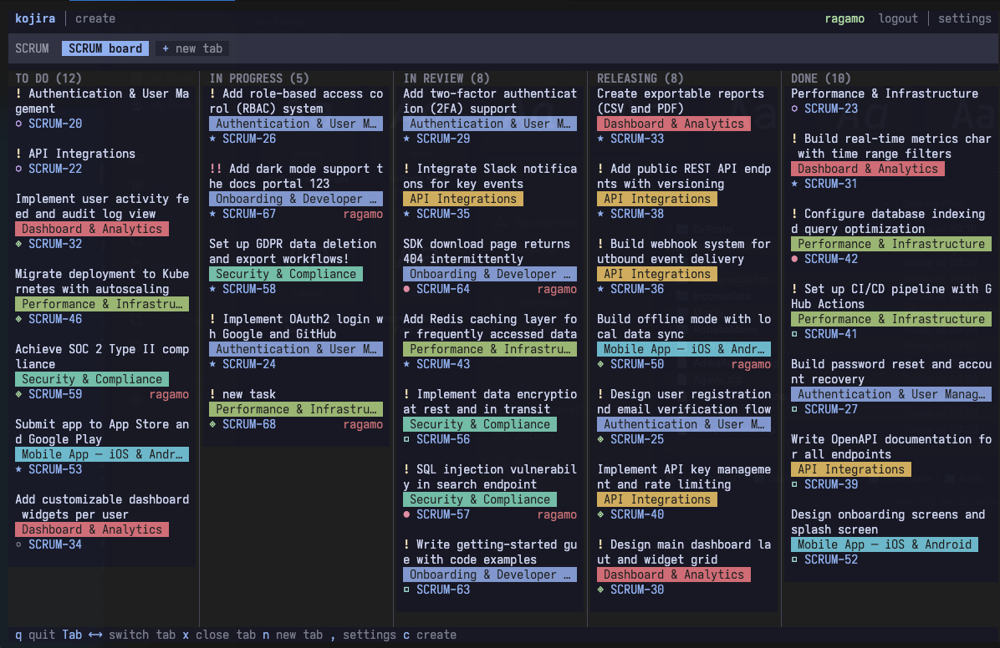
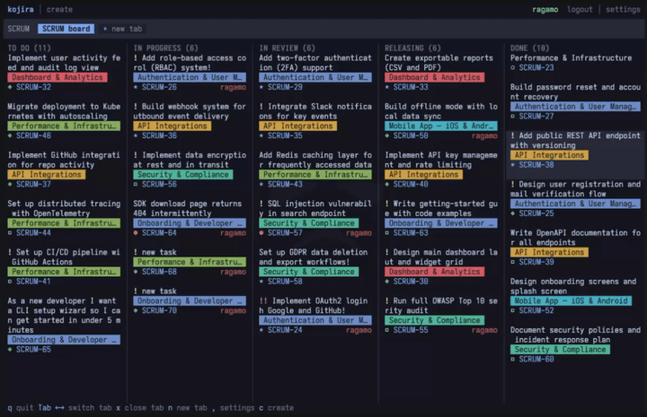
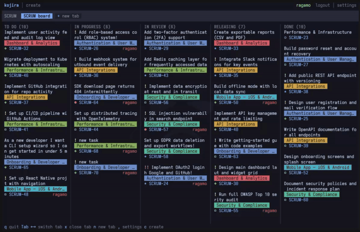
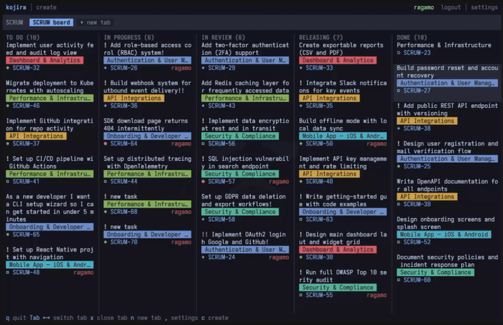
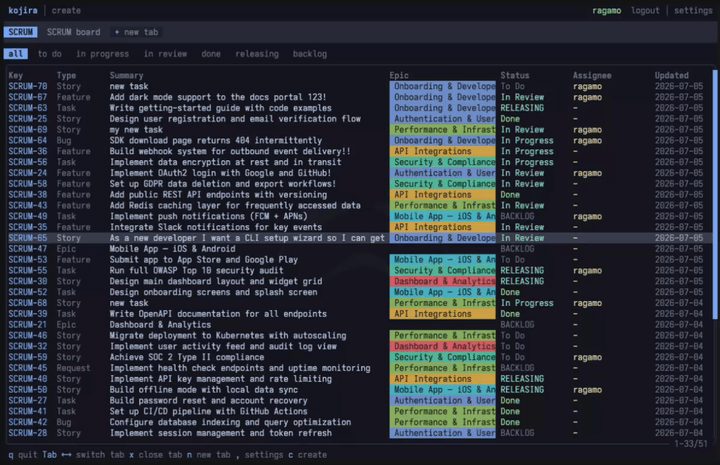
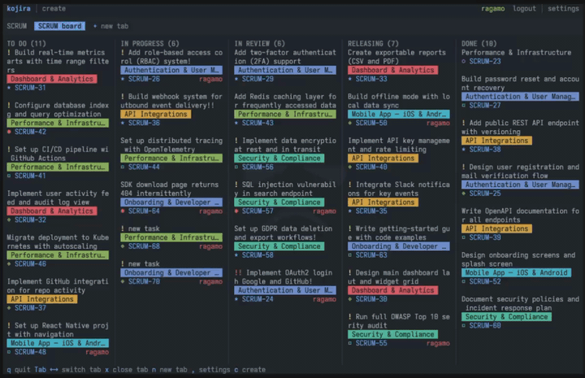
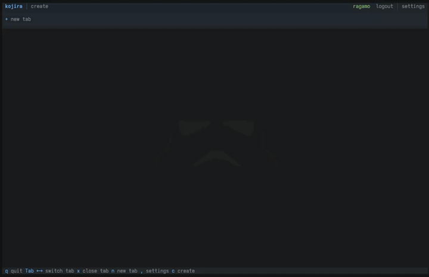

# kojira

A terminal UI for Jira — browse backlogs and boards, manage issues, and create tasks without leaving your terminal.

Built with Rust. Mouse-first interaction. Heavily inspired by [lazyglab](https://github.com/ragamo/lazyglab).

<a href="assets/main.png"></a>

## Installation

### Homebrew (macOS / Linux)

```bash
brew install ragamo/tap/kojira
```

### Install script

```bash
curl -fsSL https://raw.githubusercontent.com/ragamo/kojira/master/scripts/install.sh | sh
```

Make sure `~/.local/bin` is on your `PATH`.

### From source

Requires Rust 1.85+ (edition 2024).

```bash
git clone https://github.com/ragamo/kojira
cd kojira
cargo build --release
./target/release/kojira
```

## Configuration

The first time you run kojira you can enter your credentials directly from the login screen.

Config is stored at `~/.config/kojira/config.toml`.

```toml
[auth]
token = "your-jira-api-token"
email = "you@example.com"

[jira]
base_url = "https://yourcompany.atlassian.net"
```

## Features

- **Backlog** — list issues per project with status filters
- **Board view** — kanban-style columns with drag-and-drop to change issue status
- **Issue detail** — tabbed panel with Overview, Comments, and Transitions; editable title and description
- **Create issue** — bottom panel with title, description, type, priority, epic, and assignee selectors
- **Inline field editing** — click assignee, parent, or priority in the detail sidebar to update them directly
- **Transitions** — change issue status via the transition button or keyboard shortcut
- **Multi-tab** — open multiple projects and boards as tabs; reorder by drag-and-drop
- **Per-user tab persistence** — open tabs are saved per Jira account and restored on login
- **12 color themes** — One Dark, Catppuccin, Tokyo Night, Dracula, Nord, Gruvbox, Solarized, and more
- **Settings** — theme and UI options, persisted to config
- **Mouse support** — every interactive element is clickable

## Views

### Board / Kanban

<a href="assets/kanban.gif"></a>

### View / Edit Issue

<a href="assets/issue.gif"></a>

### Create Issue

<a href="assets/create.gif"></a>

### List Issues

<a href="assets/list.gif"></a>

### Themes

<a href="assets/themes.gif"></a>

### Tabs and Find boards

<a href="assets/tabs.gif"></a>

## Keybindings

**Global**

| Key | Action |
|-----|--------|
| `q` / `Ctrl+C` | Quit |
| `Tab` / `→` | Next tab |
| `Shift+Tab` / `←` | Previous tab |
| `1`–`9` | Jump to tab by number |
| `n` | Open project/board finder |
| `c` | Create new issue |
| `r` | Refresh active tab |
| `x` | Close active tab |
| `,` | Open settings |

**Backlog**

| Key | Action |
|-----|--------|
| `j` / `↓` | Move down |
| `k` / `↑` | Move up |
| `Enter` | Open issue detail |

**Issue detail**

| Key | Action |
|-----|--------|
| `h` / `←` | Previous tab (Overview / Comments / Transitions) |
| `l` / `→` | Next tab |
| `j` / `↓` | Scroll down |
| `k` / `↑` | Scroll up |
| `e` | Edit title and description |
| `t` | Open transition menu |
| `Esc` | Close detail |

**Transition menu**

| Key | Action |
|-----|--------|
| `j` / `↓` | Move down |
| `k` / `↑` | Move up |
| `Enter` | Apply selected transition |
| `Esc` | Cancel |

Mouse clicks work on all interactive elements: tabs, board cards, field selectors, transition button, create/settings links, and logout.
